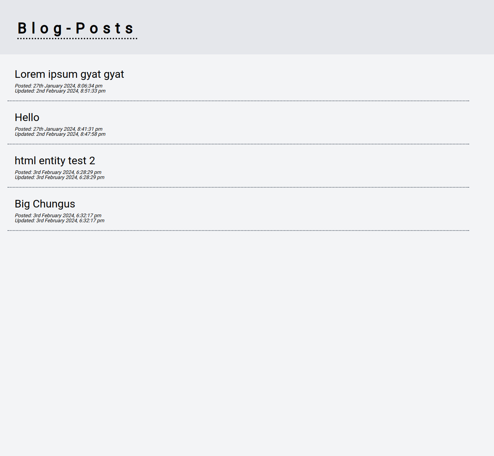
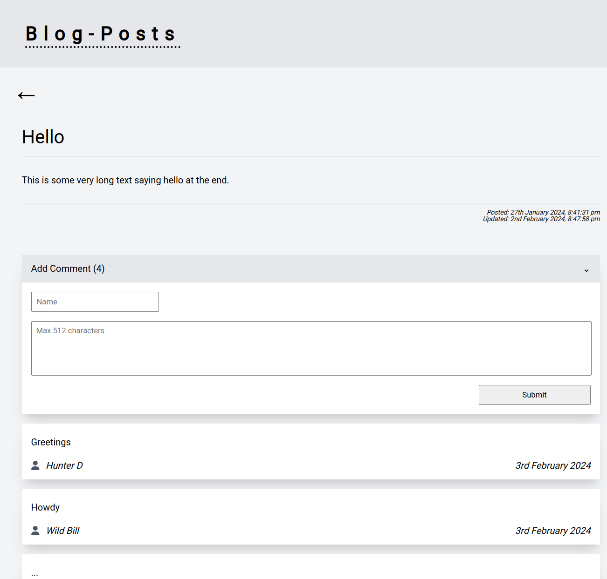
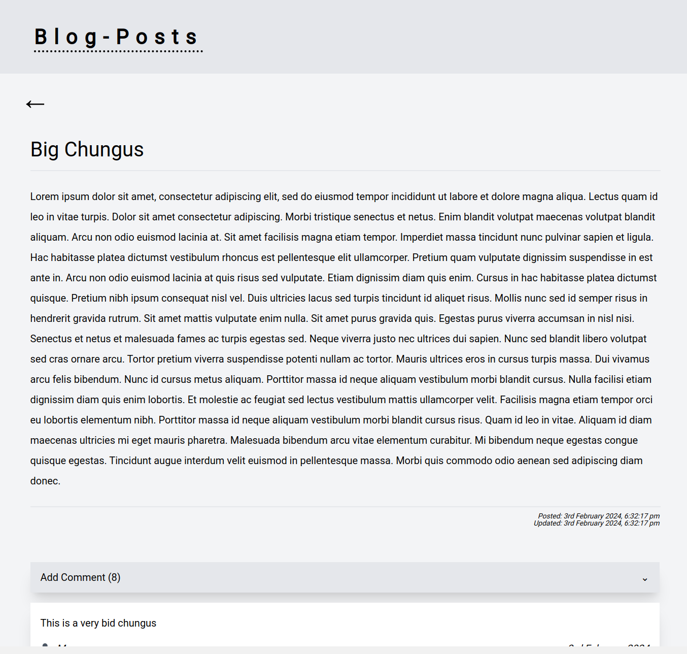

# blog-app

Blog post app created with react to be used with a custom api: https://github.com/imranprice96/blog-api.

Posts and comments are stored in a mongodb database

# Features

- Viewing posts and comments: retrieved with GET request to the api
- Adding comments: comments a send via POST request to the api

# Screenshots

Home page example displaying all blog posts:

Blog post example showing comments and comment form:

Larger blog post example:

